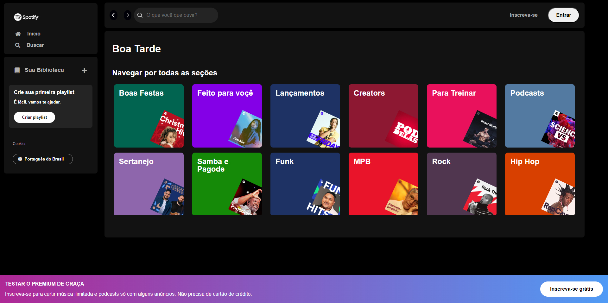

# Imersão Front-End Alura - 2024 - Clone Spotify

## Tecnologias Usadas

- HTML
- CSS
- Grid e Flex
- Javascript
- NextJS
- Biblioteca Json-Server
- Consumindo API

### Project Screenshot

## Instrutores e instrutoras da alura nessa imersão
- Guilherme Lima - Alura
- Fernanda Degolin - Desenvolvedora Front-end na Globo
- Mayara Cardoso - Desenvolvedora Front-end no Itaú

## Autor do Projeto

### Lucas Gabriel
Linkedin: https://www.linkedin.com/in/lucas-gabriel-moya/